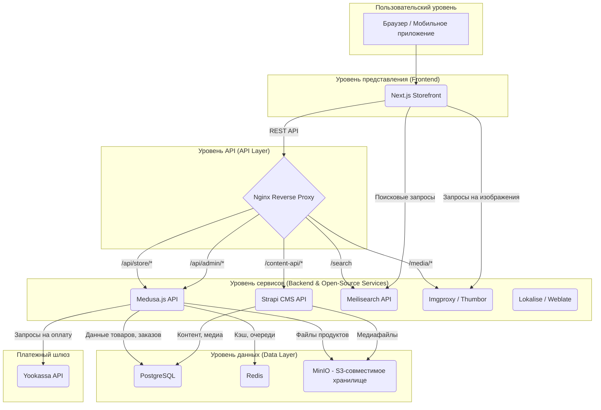

# Анализ Togas.com и архитектура Medusa.js на 100% Open-Source

## Введение

Этот документ — обновленная версия анализа сайта **Togas.com** и рекомендуемой архитектуры для вашего проекта постельного белья. Главное изменение: мы полностью избавляемся от платных облачных сервисов в пользу **100% бесплатных open-source решений**, которые вы можете развернуть на собственном VDS. Платежная система **Stripe** заменена на **Yookassa** для работы на российском рынке.

Вывод остается прежним: **архитектура на Medusa.js идеально подходит**, и теперь она становится еще более экономичной и независимой.

## 1. Анализ Togas.com как бенчмарка

Анализ ключевых характеристик сайта Togas (структура каталога, отображение товаров, страница товара, функциональность, дизайн) остается без изменений. Платформа Togas демонстрирует необходимость в мощной e-commerce системе с гибким управлением каталогом, вариантами товаров и качественным медиа-контентом. Все эти требования полностью закрываются стеком Medusa.js + Next.js.

## 2. Рекомендуемая 100% Open-Source архитектура

### Полностью Open-Source Схема



### Компоненты и их Open-Source роли

| Компонент | Платный сервис | ✅ Open-Source Альтернатива | Роль в архитектуре |
| :--- | :--- | :--- | :--- |
| **E-commerce Backend** | Shopify | **Medusa.js** | Ядро магазина: товары, заказы, клиенты, бизнес-логика. |
| **Frontend** | - | **Next.js** | Сверхбыстрый и SEO-оптимизированный сайт для пользователей. |
| **CMS** | Contentful | **Strapi** | Управление маркетинговым контентом: статьи, баннеры, страницы. |
| **Поиск** | Algolia | **Meilisearch** | Мгновенный поиск и сложная фильтрация по каталогу. |
| **Хранилище медиа** | Amazon S3 | **MinIO** | Self-hosted S3-совместимое хранилище для всех изображений и видео. |
| **Оптимизация изображений**| Cloudinary | **Imgproxy / Thumbor** | Динамическое изменение размера и оптимизация изображений на лету. |
| **Платежи** | Stripe | **Yookassa** | Прием платежей на российском рынке. |
| **Email-рассылки** | SendGrid | **Postfix + Nodemailer** | Отправка транзакционных писем (статус заказа, сброс пароля). |
| **Локализация** | Lokalise | **Weblate / JSON-файлы** | Управление переводами интерфейса на разные языки. |

## 3. Адаптация сборки под 100% Open-Source и Yookassa

### 3.1. Поиск: Meilisearch

Как и рекомендовалось ранее, **Meilisearch** является идеальным выбором. Он полностью бесплатен при развертывании на вашем VDS и легко интегрируется с Medusa. Инструкции по установке и настройке остаются прежними.

### 3.2. Оптимизация изображений: Imgproxy

Вместо платного Cloudinary мы будем использовать **Imgproxy** — очень быстрый и безопасный self-hosted сервис для обработки изображений.

**Как это работает:**
1.  Вы загружаете оригинальные, высококачественные изображения в **MinIO**.
2.  Во фронтенде Next.js вы формируете специальный URL, который указывает на ваш сервис Imgproxy.
3.  Imgproxy на лету скачивает оригинал из MinIO, изменяет его размер, применяет оптимизацию и отдает пользователю.

**Установка Imgproxy через Docker:**

```bash
# Запускаем Imgproxy контейнер
docker run -d \
  -p 8080:8080 \
  -e IMGPROXY_KEY=your_key \
  -e IMGPROXY_SALT=your_salt \
  -e IMGPROXY_USE_S3=true \
  -e IMGPROXY_S3_ENDPOINT=http://your_minio_ip:9000 \
  -e AWS_ACCESS_KEY_ID=minio_access_key \
  -e AWS_SECRET_ACCESS_KEY=minio_secret_key \
  darthsim/imgproxy:latest
```

**Использование в Next.js:**

```javascript
// Функция для генерации URL для Imgproxy
function getOptimizedImageUrl(imagePath, width, height) {
  const url = `/unsafe/${width}x${height}/smart/s3://your_bucket_name/${imagePath}`;
  // Здесь нужна логика подписи URL с помощью key и salt
  const signedUrl = signUrl(url);
  return `http://your_vds_ip:8080${signedUrl}`;
}
```

### 3.3. Интеграция с Yookassa

На данный момент официального плагина Yookassa для Medusa.js нет. Однако, вы можете легко создать свой собственный, следуя документации Medusa.

**План по созданию плагина `medusa-payment-yookassa`:**

1.  **Создать новый плагин** в директории `src/plugins/`.
2.  **Реализовать класс `YookassaService`**, который наследуется от `BasePaymentService`.
3.  **Реализовать основные методы**, которые будет вызывать Medusa:

| Метод | Описание | Что делать |
| :--- | :--- | :--- |
| `initiatePayment` | Вызывается при создании платежа. | Отправить запрос к Yookassa API для создания нового платежа. Вернуть `confirmation_url` для редиректа пользователя на страницу оплаты. |
| `retrievePayment` | Вызывается для получения статуса платежа. | Сделать запрос к Yookassa API для получения статуса платежа по его ID. |
| `capturePayment` | Вызывается для списания средств. | Если у вас двухстадийная оплата, отправить запрос на списание. |
| `refundPayment` | Вызывается для возврата средств. | Отправить запрос на возврат в Yookassa API. |
| `cancelPayment` | Вызывается для отмены платежа. | Отправить запрос на отмену в Yookassa API. |

**Пример реализации метода `initiatePayment`:**

```typescript
// src/services/yookassa.ts
import { AbstractPaymentService, PaymentContext } from "@medusajs/medusa";
import { YooCheckout } from '@yookassa/checkout-sdk';

class YookassaService extends AbstractPaymentService {
  static identifier = "yookassa";

  constructor(container, options) {
    super(container);
    this.checkout = new YooCheckout({
      shopId: options.shopId,
      secretKey: options.secretKey
    });
  }

  async initiatePayment(context: PaymentContext): Promise<any> {
    const { amount, currency_code, cart_id } = context;

    const payment = await this.checkout.createPayment({
      amount: {
        value: (amount / 100).toFixed(2), // Yookassa принимает рубли, Medusa - копейки
        currency: "RUB"
      },
      confirmation: {
        type: "redirect",
        return_url: "https://your-store.com/order/confirmed"
      },
      capture: true,
      description: `Заказ #${cart_id}`
    });

    return { ...payment };
  }

  // ... другие методы (retrievePayment, capturePayment, etc.)
}

export default YookassaService;
```

Вам нужно будет установить SDK Yookassa (`@yookassa/checkout-sdk`) и реализовать все необходимые методы, следуя их [официальной документации](https://yookassa.ru/developers/api).

## 4. Итоговая стоимость (100% Open-Source)

При полном переходе на self-hosted решения ваши ежемесячные затраты сводятся к аренде сервера.

| Компонент | Стоимость |
| :--- | :--- |
| **VDS (4 vCPU, 8GB RAM)** | $25-40/месяц |
| **Medusa.js** | Бесплатно |
| **Next.js (self-hosted)** | Бесплатно |
| **Meilisearch** | Бесплатно |
| **MinIO** | Бесплатно |
| **Imgproxy** | Бесплатно |
| **Strapi** | Бесплатно |
| **Yookassa** | Комиссия за транзакции (согласно вашему тарифу) |
| **ИТОГО (операционные расходы)** | **$25-40/месяц** |

Это **в 5-10 раз дешевле**, чем использование облачных сервисов, при этом вы получаете полный контроль, независимость и неограниченные возможности для кастомизации.

## Заключение

Да, архитектура на Medusa.js идеально подходит для создания аналога Togas. Более того, переход на **100% open-source стек** делает это решение не только мощным и гибким, но и **чрезвычайно экономичным**. Вы сможете построить e-commerce платформу премиум-класса с минимальными ежемесячными расходами, полностью контролируя все аспекты вашего бизнеса.

вашего бизнеса.

- от данных до пользовательского опыта. Интеграция с **Yookassa** потребует небольшой кастомной разработки, но это даст вам полную свободу в управлении платежами на российском рынке.
