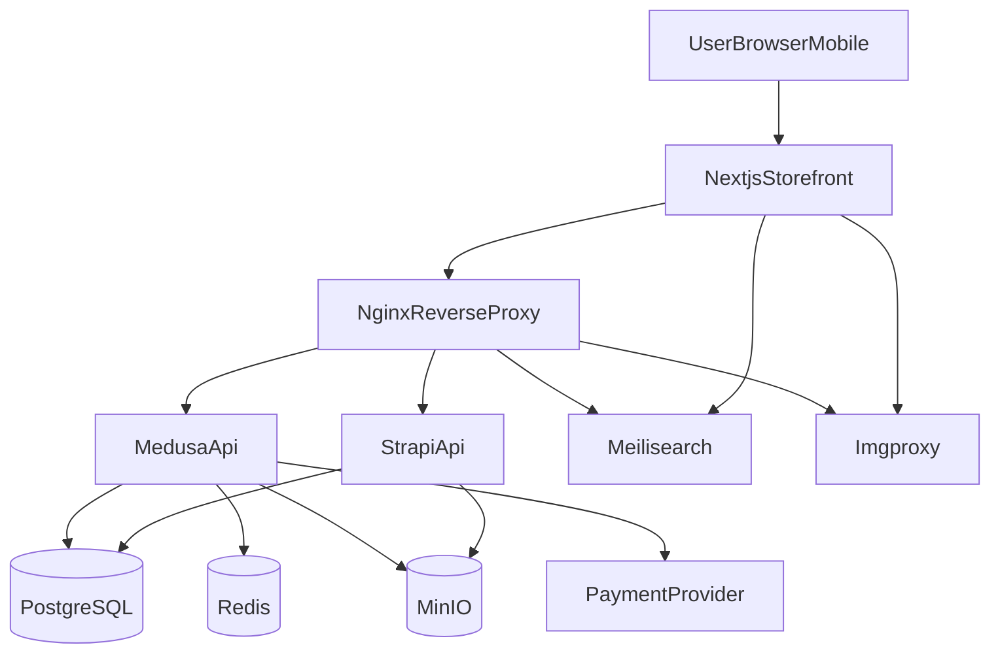

# Open-Source архитектура и роадмеп реализации (без абонплат)

## Context

Документ фиксирует целевую архитектуру e-commerce проекта Vita Brava Home на базе self-hosted решений без ежемесячных подписок на SaaS-сервисы. Основа: требования уровня Togas-подобного каталога, текущий стек монорепозитория и анализ альтернатив поиска/медиа.

## 1) Итоговый выбор архитектуры

### Принцип выбора

- Без абонентских сервисов: только open-source/self-hosted компоненты.
- Допустимые переменные расходы: инфраструктура (VDS) и транзакционные комиссии платежного провайдера.
- Приоритет: простота эксплуатации, предсказуемая стоимость, масштабируемость до среднего каталога.

### Целевой стек

- `Frontend`: `Next.js` (App Router), self-hosted.
- `Commerce`: `Medusa.js`.
- `CMS`: `Strapi`.
- `Search`: `Meilisearch` (self-hosted).
- `DB`: `PostgreSQL`.
- `Cache/queues`: `Redis`.
- `Media storage`: `MinIO` (S3-compatible).
- `Media optimization`: `Imgproxy`.
- `Edge/API routing`: `Nginx`.
- `Email`: SMTP через self-hosted MTA (`Postfix`) + `Nodemailer`.
- `Payments`: провайдер без абонплаты (в текущем контексте — `Yookassa`, оплата комиссии за транзакции).

### Почему это лучшее решение для текущего этапа

- `Meilisearch` закрывает полнотекстовый поиск + фасеты/фильтры (материал, цвет, плотность, цена) без SaaS-стоимости.
- `MinIO + Imgproxy` заменяют Cloudinary/Imgix: хранение оригиналов и быстрая динамическая отдача производных размеров.
- `Medusa + Strapi` разделяют e-commerce и контентный контур без vendor lock-in.
- Все критичные данные и интеграции контролируются командой на своей инфраструктуре.

## 2) Архитектурная схема

## 3) Scope и границы стоимости

### Включено в архитектуру

- Каталог, карточка товара, поиск, фильтры, корзина, checkout, заказы.
- Контентные страницы и маркетинговые блоки через CMS.
- Транзакционные письма и базовая наблюдаемость.

### Не включено в MVP

- Персонализация на ML/векторном поиске.
- Сложная BI-аналитика поверх поискового слоя.
- Мульти-региональная актив-актив инфраструктура.

### Стоимость (операционная модель)

- Фиксированные расходы: `VDS + backup storage`.
- Переменные расходы: комиссия платежного провайдера.
- Абонентская плата SaaS-сервисам поиска/медиа/контента: `0`.

## 4) Роадмеп реализации (MVP -> production)

## 4.1 Этап 1 — Базовая инфраструктура

**Задачи**

- Поднять `PostgreSQL`, `Redis`, `MinIO`, `Meilisearch`, `Imgproxy`, `Nginx` в `docker-compose`.
- Настроить приватные сети, volumes, healthchecks, базовые секреты окружения.

**Definition of Done**

- Все контейнеры стартуют и проходят healthcheck.
- Сервисные endpoints доступны только через `Nginx` (кроме админского доступа по whitelist).

**Риски**

- Ошибки маршрутизации/портов, открытые сервисы наружу.

**Rollback**

- Возврат к предыдущему `docker-compose` и переменным окружения.
- Отключение новых сервисов через profile/compose override.

## 4.2 Этап 2 — Commerce + CMS ядро

**Задачи**

- Подключить `Medusa` к `PostgreSQL/Redis/MinIO`.
- Подключить `Strapi` к `PostgreSQL/MinIO`.
- Зафиксировать базовую модель данных и миграции.

**Definition of Done**

- CRUD товаров/вариантов/категорий в админке Medusa.
- CRUD контента в Strapi и публикация в storefront.

**Риски**

- Конфликты схем, несовместимые версии зависимостей.

**Rollback**

- Откат миграций и образов до предыдущих тегов.
- Восстановление из snapshot БД.

## 4.3 Этап 3 — Каталог и товарная модель под текстиль

**Задачи**

- Внедрить атрибуты: размер, материал, плотность ткани, цвет.
- Настроить варианты, ценовые правила, метки (новинки/скидки/эксклюзив).

**Definition of Done**

- Полноценная карточка товара с вариантами и корректным ценообразованием.
- Категорийная иерархия поддерживает бизнес-навигацию.

**Риски**

- Разрастание неунифицированных атрибутов.

**Rollback**

- Миграция к предыдущей схеме атрибутов.
- Временное скрытие новых фильтров на storefront.

## 4.4 Этап 4 — Поиск и фасетная фильтрация

**Задачи**

- Реализовать индекс `Medusa -> Meilisearch` (initial sync + incremental updates).
- Настроить `filterable/sortable/facets` по ключевым атрибутам.
- Подключить UI фильтров и сортировки на storefront.

**Definition of Done**

- Поиск и фильтры корректно работают по тестовому каталогу.
- Обновления товара отражаются в индексе в допустимое время.

**Риски**

- Дрейф данных между БД и индексом, ошибки маппинга атрибутов.

**Rollback**

- Переключение storefront на fallback-поиск API Medusa.
- Полная реиндексация из актуальной БД.

## 4.5 Этап 5 — Медиа-конвейер MinIO + Imgproxy

**Задачи**

- Хранить оригиналы в `MinIO`.
- Отдавать производные изображения через `Imgproxy` с пресетами размеров.
- Настроить кэширование и TTL на уровне `Nginx`.

**Definition of Done**

- Каталог и карточки отдают оптимизированные изображения без деградации качества.
- Стабильное время ответа медиа-эндпоинтов под нагрузкой.

**Риски**

- Неверные подписи URL/ACL, неконсистентность путей до объектов.

**Rollback**

- Временный переход на прямую отдачу оригиналов из MinIO.
- Отключение трансформаций до устранения ошибок.

## 4.6 Этап 6 — Платежи, checkout, заказы

**Задачи**

- Подключить платежный провайдер с транзакционной моделью.
- Настроить webhook/callback, статусы платежа и заказа, idempotency.

**Definition of Done**

- Полный цикл `cart -> checkout -> payment -> order confirmation` проходит успешно.
- Некорректные/повторные callback не ломают заказ.

**Риски**

- Потеря callback, двойное списание, расхождения статусов.

**Rollback**

- Временное отключение онлайн-оплаты и перевод в ручное подтверждение.
- Повторная синхронизация статусов по API провайдера.

## 4.7 Этап 7 — Email и операционные уведомления

**Задачи**

- Настроить `Postfix + Nodemailer` для транзакционных писем.
- Внедрить шаблоны: подтверждение заказа, изменение статуса, сброс пароля.

**Definition of Done**

- Письма стабильно доставляются в основных сценариях.
- Логи отправки и базовые алерты доступны команде.

**Риски**

- Низкая deliverability, попадание в spam.

**Rollback**

- Временный relay через резервный SMTP.
- Упрощение шаблонов и корректировка SPF/DKIM/DMARC.

## 4.8 Этап 8 — Hardening и observability

**Задачи**

- Резервное копирование БД/объектного хранилища.
- Лимиты, rate-limit, ротация логов, базовые алерты.
- Smoke и regression чек-листы перед релизом.

**Definition of Done**

- Восстановление из backup проверено на стенде.
- Критичные ошибки детектируются и диагностируются по логам.

**Риски**

- Непроверенные backup-процедуры, слепые зоны мониторинга.

**Rollback**

- Возврат на предыдущий стабильный релиз storefront/API.
- Восстановление данных из последнего валидного backup.

## 5) Зависимости и порядок запуска

1. Infra (`PostgreSQL`, `Redis`, `MinIO`, `Meilisearch`, `Imgproxy`, `Nginx`).
2. `Medusa` и `Strapi`.
3. Каталог и модели данных.
4. Индексация и фильтры.
5. Медиа-оптимизация.
6. Платежи и email.
7. Hardening, нагрузочная проверка, go-live.

## 6) Чек-лист перед стартом реализации

- Утвердить среду и параметры VDS (CPU/RAM/диск/backup policy).
- Утвердить платежного провайдера и юридические требования.
- Зафиксировать SLA/SLO для storefront и checkout.
- Согласовать лимиты MVP (без персонализации и тяжёлой аналитики).

## 7) Примечание по актуальности документации

Перед технической реализацией каждого этапа необходимо актуализировать API/конфиги через MCP Context7 для: `Next.js`, `Medusa`, `Strapi`, `Meilisearch`, `Imgproxy`.

## 8) База проектных знаний

- Все значимые внедрения и решения фиксируй в базе знаний: `frontend/docs/project-knowledge/README.md`.
- Отчёты по задачам веди по шаблону: `frontend/docs/project-knowledge/tasks/TEMPLATE.md`.
- Долгоживущие архитектурные решения выноси в: `frontend/docs/project-knowledge/decisions/`.
